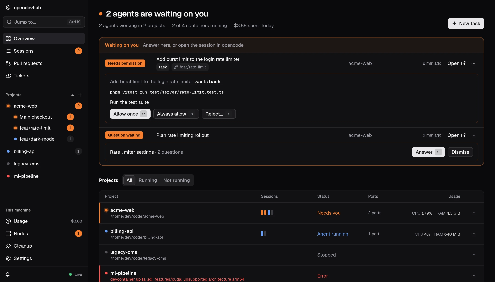

<div align="center">


# opendevhub

**A local dashboard for [opencode](https://opencode.ai) agents, each running inside its project's devcontainer.**

[](https://www.npmjs.com/package/opendevhub) [](https://github.com/tim-richter/opendevhub/actions/workflows/ci.yml) [](https://tim-richter.github.io/opendevhub/docs)

[Documentation](https://tim-richter.github.io/opendevhub/docs) · [Getting started](https://tim-richter.github.io/opendevhub/docs/getting-started) · [Contributing](CONTRIBUTING.md)



</div>

Watch, answer and review all your agents from one page: run tasks in parallel git worktrees, compare models on the same prompt, and publish the result as a pull request.

## Install

You need:

- Linux or macOS
- Docker (on macOS: Docker Desktop, OrbStack, Colima or similar)
- The devcontainer CLI: `npm i -g @devcontainers/cli`
- Node.js 22.13 or newer

opencode v2 has to be installed in each project's devcontainer. **Add project** sets this up for you; see [Getting started](https://tim-richter.github.io/opendevhub/docs/getting-started) for doing it yourself.

## Quick start

```bash
npx opendevhub
```

1. The dashboard opens at `http://localhost:7777` (`--port 8080` picks another port, `--no-open` skips the browser).
2. Open **Settings → Projects** and add the folders that hold your git repos, for example `~/code`.
3. Projects with a devcontainer show up in the sidebar. For a repo without one, use **+** next to Projects.
4. Start a project, then press `n` to give an agent its first task.

Everything else, from worktrees and checks to publishing and integrations, is in the [documentation](https://tim-richter.github.io/opendevhub/docs).
