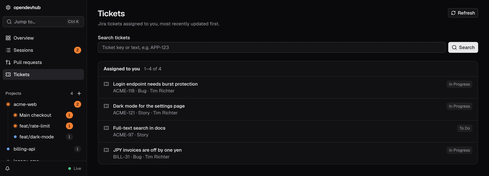
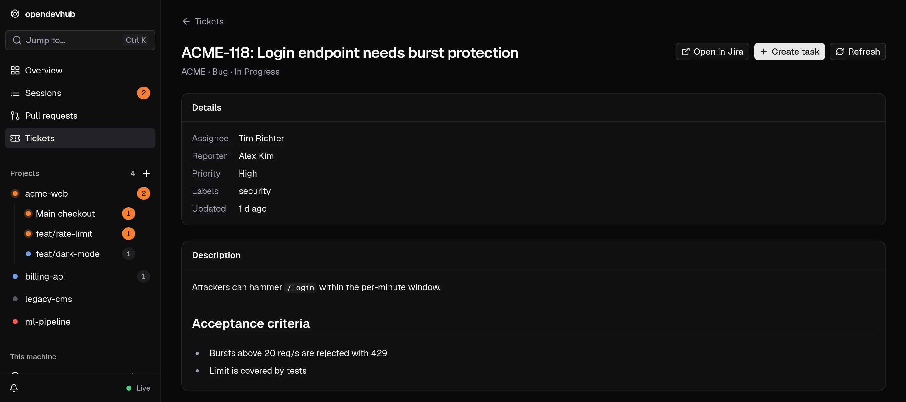

Jira is an optional integration, disabled by default. Open **Settings**, enable **Jira**, and save your self-hosted Jira instance URL and personal access token. Include the context path in the URL if your instance uses one, for example `https://jira.example.com/jira`. Use HTTPS; loopback HTTP is supported for local instances.

This integration uses Jira Server / Data Center's REST v2 API with Bearer authentication. Create a personal access token in your Jira profile with access to the projects you need. Only the URL and token are required. Jira Cloud's email and API token authentication is not supported by this integration.

## Browse tickets

**Tickets** appears in the sidebar when Jira is enabled. The list defaults to tickets assigned to the connected account, most recently updated first. Search by an exact key, such as `APP-123`, or a phrase in the ticket text. Searches include other assignees, limited to projects accessible to your token. **Assigned to me** restores the default list. **Next page** loads more results; **Refresh** reloads the current page.

Select a ticket to see its description, project, status, type, assignee, reporter, priority, labels, and update time. Descriptions are displayed as text, including Jira wiki markup. **Open in Jira** opens the original ticket.

## Create a task

**Create task** opens the existing New task dialog with the ticket title and description filled in. Choose your local project, worktree, environment, models, and agent as usual. You can edit the prompt before starting. The agent receives the ticket key, URL, title, and description, without receiving the integration token.

Every task variant stores the originating Jira instance, key, title, and original description in its opencode session metadata. This reference survives restarts with the session and is shown on the task page and on its checkout's review page. The original description remains available when Jira is disabled or unreachable. **Ticket details** opens the current ticket when the same Jira instance is connected. The ticket page also links to tasks associated with it among the dashboard's listed sessions.

## Saved settings

The URL, enabled state, and opaque credential reference are saved in `~/.config/opendevhub/integrations/jira.json` (or under `XDG_CONFIG_HOME`), with mode `0600` inside a `0700` directory. The token is stored separately in macOS Keychain, Windows Credential Manager, or persistent Secret Service on Linux, using its own Jira service. The token is never returned to the browser, saved in the settings file, or injected into task containers. An unavailable or locked credential store causes an actionable error; there is no plaintext fallback.

A saved token shows as **Token saved**; **Replace** lets you paste a new one. Changing the instance URL requires a new token. Disabling retains the credential; **Remove token…** deletes it and turns Jira off.

Jira access is read-only: creating a task does not change ticket status, assignments, or comments. Individual API responses are limited to 20 MiB, and task prompts and description snapshots are limited to 100,000 characters.
