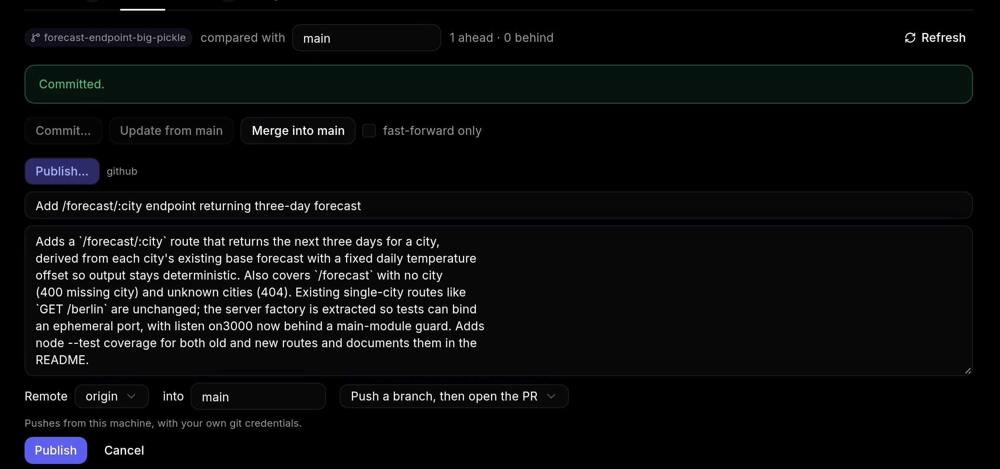

**Publish…** in the Review tab's **Git** menu pushes a branch and opens a pull request on the forge.



- The push runs on your machine with your own ssh-agent and credential helpers, so pre-push hooks run there too. If the checkout isn't usable on the host, it runs in the container instead. `OPENDEVHUB_PUSH=host|container` forces one. Git never prompts for credentials: a missing one fails the push.
- The forge is detected from the remote URL: the `forges` map in `config.json` first, then the built-in hosts (`github.com`, `gitlab.com`, `codeberg.org`, `bitbucket.org`), then a one-time unauthenticated probe of the host's Forgejo/Gitea API. The result is cached in `config.json`; delete the entry to probe again. Unreachable hosts aren't cached.
- Forgejo and Gitea default to AGit (`refs/for/<base>`), which opens the PR on push. Other forges push the branch and open a pre-filled compare page.
- opendevhub never force-pushes. If the remote branch has commits yours doesn't, pull them and publish again.

## Configure a forge

To tell opendevhub about a host, or an ssh alias it can't probe, add it to `~/.config/opendevhub/config.json`:

```json
{
  "forges": {
    "git.example.com": { "kind": "forgejo" },
    "work": { "kind": "gitlab", "web": "https://gitlab.example.com" }
  }
}
```

`kind` is one of `github`, `gitlab`, `forgejo`, `gitea`, `bitbucket` or `unknown`. `web` is the site's origin, needed when the remote host is an ssh alias (`work:team/app.git`).
