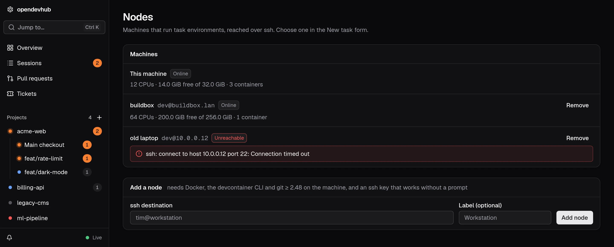

Other machines can run task environments, reached over ssh. This is a preview.

Add a node on the **Nodes** page, or from the command line, then restart opendevhub:

```bash
opendevhub nodes add tim@workstation --label Workstation
```

The Nodes page shows whether each node is reachable and ready, and how much CPU and memory it has free.



## Run a task on a node

Pick the node in the [New task](/docs/tasks) form. The task gets a new worktree with its own container on that node: opendevhub pushes the base branch (the one you choose, or the main checkout's current branch) into a repository it keeps under `~/.opendevhub/repos` on the node, creates the worktree there, and starts the container with the node's Docker. Uncommitted changes in your main checkout stay behind.

Sessions, permissions, forwarded ports, review, commit and Update from base work as for local tasks. **Bring home** (in the review's Git menu) fetches the branch into this machine's repository; Merge into base and [Publish](/docs/publish) do that first. Removing the task deletes its worktree and branch on the node, so bring the branch home first to keep its commits. [Checks](/docs/checks) and Open in editor aren't available for tasks on other nodes yet.

## Node requirements

- Docker, the devcontainer CLI and git 2.48 or newer, on the PATH of a **non-interactive** ssh shell. Tools installed through nvm or a login profile often aren't: check with `ssh tim@workstation 'devcontainer --version'`, and if it fails, link the binary into `/usr/local/bin` or set PATH in `~/.ssh/environment` (with `PermitUserEnvironment yes`).
- An ssh key that logs in without a prompt, and a known host key: run `ssh tim@workstation` once.
- `AllowTcpForwarding yes` in its sshd config (the default).
- A Linux Docker engine: containers are reached at their IP from the node itself.

## Connection

opendevhub keeps one ssh connection per node (a ControlMaster under `~/.config/opendevhub/ssh/`) and reconnects by itself when a node drops. Meanwhile its tasks show as offline. Containers keep running there and are picked up again when the node is back. Nothing is installed on the node and nothing listens there besides sshd.
