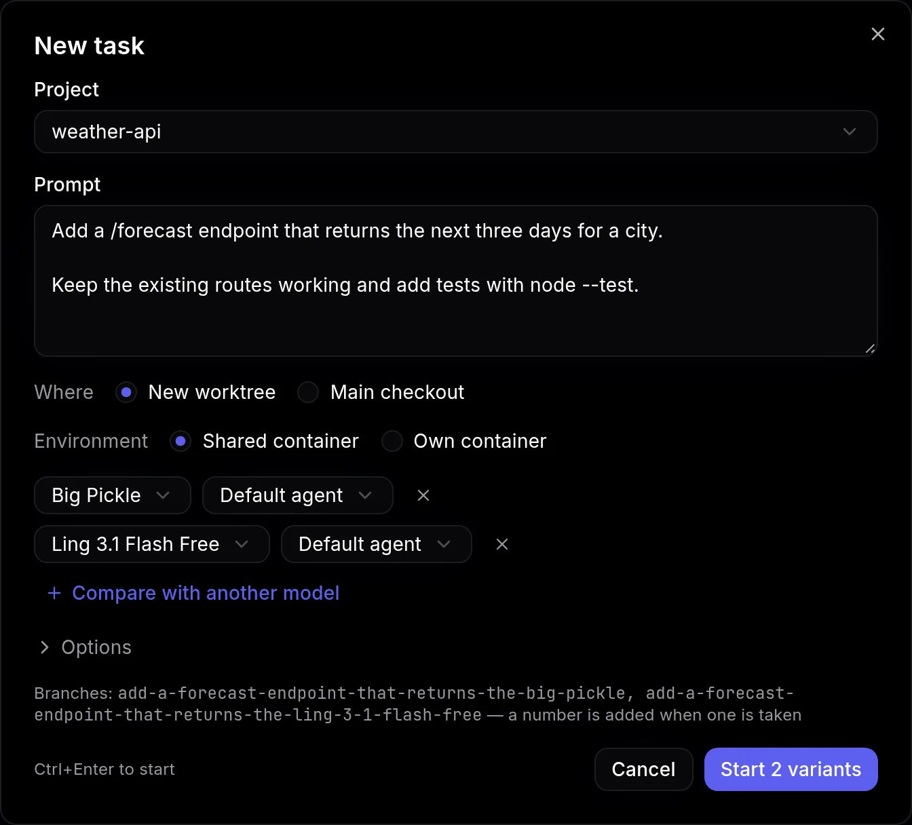
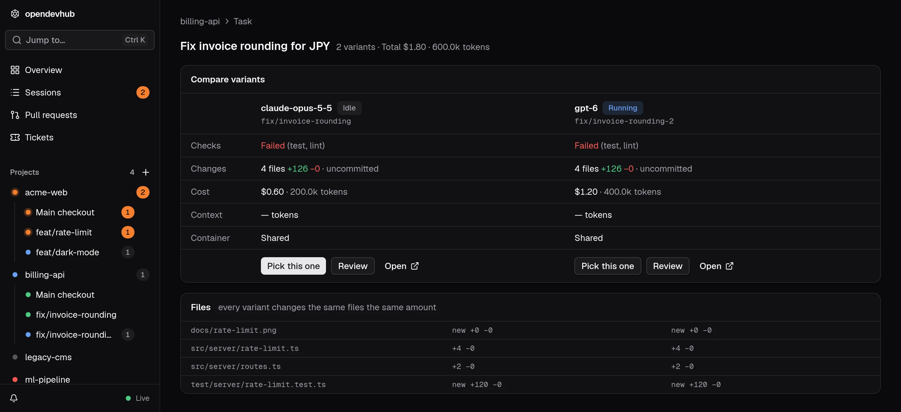
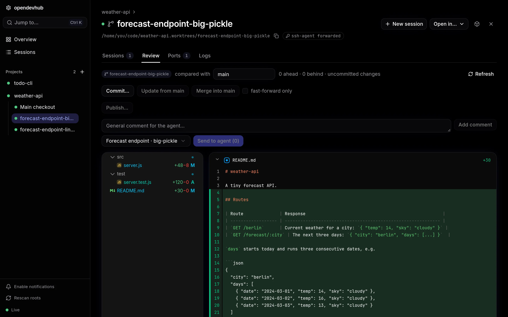

**New task** starts agent work from a prompt, without opening the opencode tab. It's on the Overview and project pages and in `⌘K`, or press `n`.

By default a task creates a [worktree](/docs/worktrees) on a branch named after the prompt's first line (`-2`, `-3`… when the name is taken), starts a session there and sends the prompt. **Main checkout** runs it in the project folder instead. **Environment: Own container** runs it in its [own container](/docs/worktrees#own-containers).

## Compare models

**Compare with another model** runs the same prompt on up to four models, each in its own worktree (`<branch>-<model>`). The task page shows each variant's status, cost, tokens and changes, with a Review link. Each variant's cost and tokens include its subagents, and the task's total above the cards includes discarded variants.

**Pick this one** hides the other variants. It can also remove their worktrees and branches, after a confirmation that lists any uncommitted changes.

## Where tasks are stored

A task is stored in its sessions' opencode metadata (`metadata.opendevhub`), so it survives restarts of opendevhub and of the container.

## Review and publish

Each checkout has a **Review** tab that shows the changes. When you're happy with them, [Publish](/docs/publish) pushes the branch and opens a pull request.

